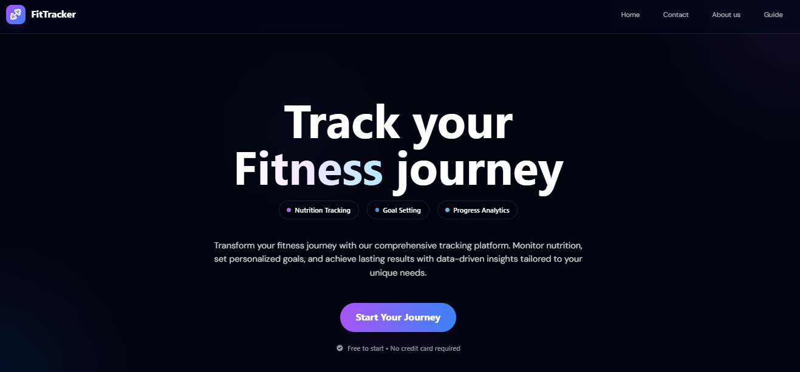
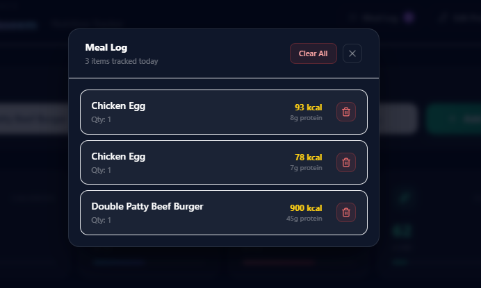
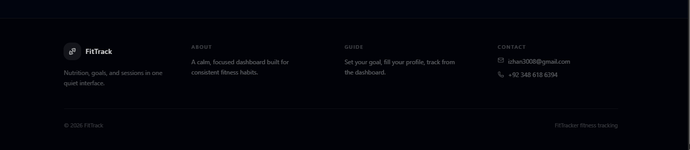
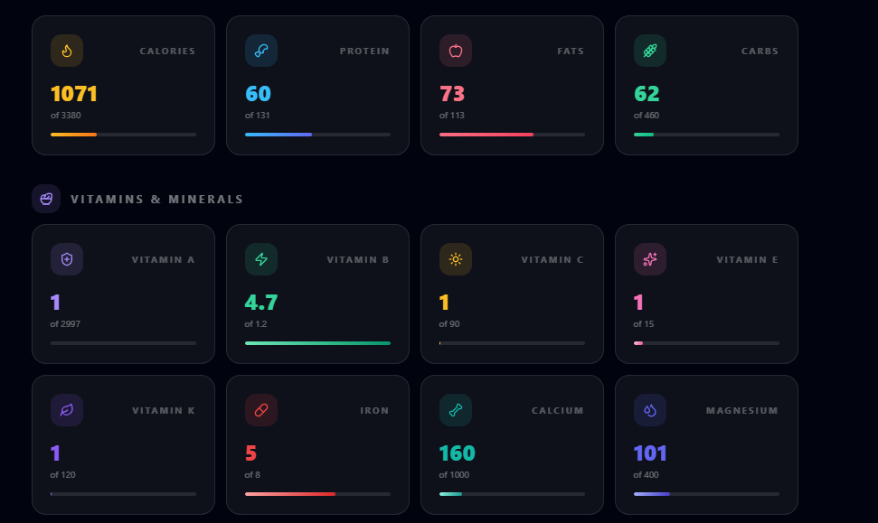

# FitTrack App

FitTrack is a full-stack fitness and nutrition tracking app built with React, Express, and MongoDB. It helps users set up their profile, track calorie and nutrition intake, search food data, select foods portion-wise, and manage active sessions across devices.

This project is structured as a real deployed application, not just a frontend demo. It includes authentication, Google sign-in, email-based account flows, session management, onboarding logic, and password reset with OTP protection.

## Highlights

- Email/password authentication with JWT-based access tokens
- Google sign-in support
- Session tracking across devices with remote session revocation
- Onboarding flow for profile completion
- Food search, portion-aware selection, and paginated food browsing
- Persisted user tracking state
- OTP-based password reset with expiry and request limiting
- Resend-based transactional email delivery
- Split backend architecture with routes, controllers, middleware, services, and utils

## Tech Stack

- Frontend: React, React Router, Axios, Tailwind CSS
- Backend: Node.js, Express
- Database: MongoDB with Mongoose
- Auth: JWT, bcrypt, Google Identity
- Email: Resend
- Deployment: frontend and backend deployed separately

## Project Structure

```text
src/
  components/
  App.jsx
  main.jsx

backend/
  app.js
  controllers/
  middleware/
  routes/
  services/
  test/
  utils/
  views/
  server.js

e2e/
  signin-dashboard.spec.js

Model/
  Registerdata.js
  Foods.js
  Sessions.js
  Otp.js
  OtpRequest.js
```

## Core Features

### Authentication and Sessions

- Sign up with email verification
- Sign in with email/password
- Sign in with Google
- Refresh short-lived access tokens using server-side session state
- View all logged-in sessions
- Revoke other active sessions

### Profile and Onboarding

- Multi-step onboarding for profile completion
- Store physical profile data such as weight, height, activity, and goal
- Track whether onboarding is complete
- Edit profile after signup

### Fitness and Nutrition Tracking

- Browse food data with pagination
- Search foods by name
- Select foods by serving/portion size before adding them to the meal log
- Save and restore the user's working nutrition array/state
- Display dashboard data for macros and micros

### Password Reset

- Request OTP by email
- OTP expires automatically after 5 minutes
- OTP requests are limited to 10 per 6 hours per email

## Backend Architecture

The backend was refactored from a single large file into focused modules:

- `routes/`: endpoint registration
- `controllers/`: request handling logic
- `middleware/`: auth/session verification
- `services/`: reusable service logic such as session creation
- `utils/`: helpers for validation, token generation, safe user projections, and profile-completion logic

This keeps `backend/app.js` focused on Express app creation and route mounting, while `backend/server.js` handles database connection and server startup.

## Main API Areas

- Auth: `/signin`, `/signin/google`, `/register`, `/verify/:token`, `/refresh-token`
- Profile: `/getdata`, `/data`, `/mode`, `/activity`, `/goals`, `/editdata`, `/checkData`
- Foods: `/getfood`, `/getfood2`, `/search`, `/store`
- Sessions: `/sessions`, `/logout`, `/logoutsession`
- Password reset: `/forgot-password`, `/change-password`

## Screenshots

### Home Page



### Dashboard


### Food Search and Portion Selection


### Food Catalog


### Edit Selected Food



### Session Management


### Footer



### Product Infographics



## Local Setup

### 1. Install dependencies

```bash
npm install
```

### 2. Configure environment variables

Create a `.env` file in the project root and add the variables your local setup needs.

Example:

```env
PORT=5000
MONGODB_URI=your_mongodb_connection_string
SECRET_KEY=your_access_token_secret
REFRESH=your_refresh_token_secret
JWT_VERIFY=your_email_verification_secret
SERVER_BASE_URL=http://localhost:5000

GOOGLE_CLIENT_ID=your_google_client_id

RESEND_API_KEY=your_resend_api_key
RESEND_FROM_EMAIL=hello@yourdomain.com
RESEND_FROM_NAME=FitTrack App

VITE_API_URL=http://localhost:5000
VITE_GOOGLE_CLIENT_ID=your_google_client_id
```

### 3. Start the backend

```bash
npm run start:server
```

### 4. Start the frontend

```bash
npm run dev
```

## Testing

This repo uses Vitest for both frontend and backend testing.

Run the full test suite:

```bash
npm run test:run
```

Run the backend integration test suite:

```bash
npm.cmd run test:backend
```

Run the Playwright end-to-end suite:

```bash
npm.cmd run test:e2e
```

Run a single backend integration file:

```bash
npm.cmd run test:backend -- auth.test.js
```

Run the auth component tests directly:

```bash
npm run test:run -- src/components/__tests__/Signin.test.jsx src/components/__tests__/Register.test.jsx
```

Frontend coverage includes:

- dashboard rendering and food dropdown interaction
- dashboard persisted meal-log rendering
- dashboard edit-profile navigation
- sign-in form rendering and successful auth redirect
- incomplete-profile redirect handling after sign-in
- invalid-credentials handling on sign-in
- sign-in network-failure alert handling
- change-password OTP rate-limit alert handling
- registration form rendering and successful signup redirect
- client-side registration validation for mismatched passwords
- existing-email handling during registration
- registration failure alert handling

Backend integration coverage includes:

- auth route tests for invalid sign-in, valid sign-in, token refresh, and invalid session refresh rejection
- session route tests for missing auth rejection, session listing, remote session revocation, and active-session protection
- password-reset route tests for unknown-user rejection, OTP creation, successful password change, invalid OTP rejection, and OTP rate limiting

Backend integration tests use `supertest` against [`backend/app.js`](/C:/Users/izhan/Desktop/Node%20JS/React/new%20fitness%20app/backend/app.js). The shared setup in [`backend/test/setup.js`](/C:/Users/izhan/Desktop/Node%20JS/React/new%20fitness%20app/backend/test/setup.js) connects to `TEST_MONGODB_URI` when provided, otherwise it uses `MONGODB_URI` with an isolated `fittrack_test_*` database name. External email delivery is mocked in route tests so no real Resend calls are made.

Playwright end-to-end coverage includes:

- sign in with a seeded user
- add a seeded food item from the dashboard
- open the meal log and confirm the tracked food appears

The Playwright setup uses [`playwright.config.js`](/C:/Users/izhan/Desktop/Node%20JS/React/new%20fitness%20app/playwright.config.js) to boot isolated frontend and backend servers on dedicated e2e ports and uses an isolated MongoDB database name for the flow.

GitHub Actions currently runs `npm run test:run` on every push and pull request through [`.github/workflows/test.yml`](/C:/Users/izhan/Desktop/Node%20JS/React/new%20fitness%20app/.github/workflows/test.yml).

## Production Notes

- `MONGODB_URI` must be provided in the deployment environment
- Resend must be configured with a verified sending domain
- `RESEND_API_KEY`, `RESEND_FROM_EMAIL`, and `RESEND_FROM_NAME` are required for email delivery
- Google sign-in requires valid Google client configuration on both frontend and backend

## Security Notes

- Passwords are hashed with bcrypt
- Protected routes require JWT plus session identity
- OTP records expire automatically
- OTP generation is rate-limited per email
- Sensitive user fields are excluded from profile responses

## Areas Improved During Refactor

- Split monolithic backend into modules
- Removed hardcoded database credentials
- Replaced Gmail OAuth email sending with Resend
- Fixed profile completion persistence
- Fixed broken activity route handling
- Added safer input validation utilities
- Reduced accidental exposure of sensitive user fields

## Why This Project Matters

This project demonstrates practical full-stack engineering beyond basic CRUD:

- authentication and session lifecycle management
- frontend/backend coordination
- transactional email flows
- onboarding state management
- deployment-aware environment configuration
- iterative backend refactoring toward cleaner architecture

## Author

Built by Izhan as a production-style portfolio project focused on full-stack product development, auth/session flows, and applied backend architecture.
